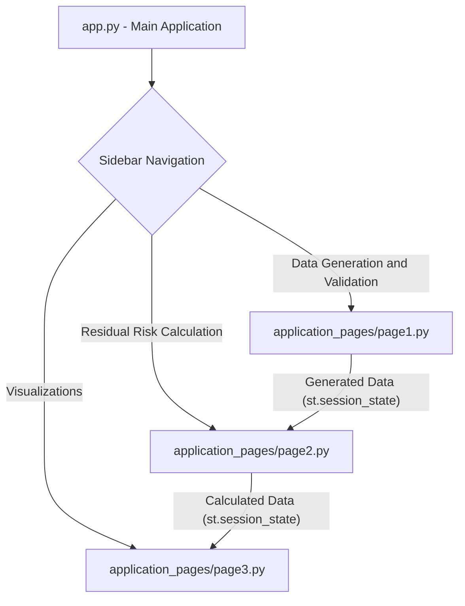

id: 6871525c558fdb1b582c49ab_documentation
summary: Second Lab of Module 3 Documentation
feedback link: https://docs.google.com/forms/d/e/1FAIpQLSfWkOK-in_bMMoHSZfcIvAeO58PAH9wrDqcxnJABHaxiDqhSA/viewform?usp=sf_link
environments: Web
status: Published
# Operational Risk Management Simulation with Streamlit

## 1. Introduction to Operational Risk Management Simulation
Duration: 0:08:00

In this codelab, you will dive into the fascinating world of operational risk management through a hands-on, interactive simulation built using Streamlit. This application, named **QuLab**, serves as an educational tool for developers and risk practitioners to explore how various factors influence an organization's risk profile.

<aside class="positive">
<b>Why is this important?</b> Operational risk is a critical component of enterprise risk management (ERM). It encompasses risks arising from failures in internal processes, people, and systems, or from external events. Understanding how these risks are identified, assessed, and mitigated is crucial for business resilience and strategic decision-making.
</aside>

### Key Concepts Explored:

*   **Inherent Risk:** This is the level of risk existing before any controls or mitigation strategies are applied. Think of it as the raw risk associated with an activity or process.
*   **Control Effectiveness:** This measures how well existing controls mitigate the inherent risk. Controls can be preventative (stopping an event before it occurs), detective (identifying an event after it occurs), or corrective (fixing an issue after it occurs).
*   **Residual Risk:** This is the risk that remains after all controls have been implemented and are operating effectively. It's the "leftover" risk that an organization must accept, transfer, or further mitigate.

### The QuLab Application:
QuLab allows you to interactively:
1.  **Generate and Validate Synthetic Operational Risk Data:** Create datasets with varying numbers of risk units and optional time-series components.
2.  **Calculate Residual Risk:** Experiment with different methods (Basic, Weighted) to understand how inherent risk and control effectiveness combine to determine the final residual risk.
3.  **Visualize Risk Relationships and Trends:** Explore interactive plots showing relationships between risk factors and trends over time.

### Fundamental Formulae for Residual Risk:
The core idea behind residual risk calculation is that it's a function of inherent risk and control effectiveness. In this simulation, we explore two simplified methods:

$$ \text{Residual Risk} = f(\text{Inherent Risk}, \text{Control Effectiveness}) $$

For the **'Basic'** method, it's an additive relationship (or rather, subtractive, representing mitigation):
$$ \text{Residual Risk Score} = \text{Inherent Risk Score} - \text{Control Effectiveness Score} $$

For the **'Weighted'** (or multiplicative/ratio-based) method:
$$ \text{Residual Risk Score} = \frac{\text{Inherent Risk Score}}{\text{Control Effectiveness Score}} $$

Where:
*   `Inherent Risk Score` is a numerical representation (e.g., 1-4 for Low to Very High).
*   `Control Effectiveness Score` is a numerical representation (e.g., 1-3 for Low to High).

<aside class="negative">
<b>Important Disclaimer:</b> The data generated by this application is synthetic and purely for illustrative and educational purposes. It should NOT be used for real-world risk management decisions. The calculation methods are simplified and may not reflect complex risk models used in practice.
</aside>

### Application Architecture and Flow:

The QuLab application follows a modular architecture using Streamlit's multi-page application pattern, albeit implemented using `st.sidebar.selectbox` and conditional page loading.



*   `app.py`: The entry point. Sets up the page configuration, displays the main title and introduction, and handles navigation via the sidebar. It dynamically imports and runs the functions for each page based on user selection.
*   `application_pages/page1.py`: Handles the generation of synthetic operational risk data and performs basic data validation. It stores the generated DataFrame in Streamlit's `session_state` for use by other pages.
*   `application_pages/page2.py`: Focuses on calculating residual risk. It retrieves the data from `session_state`, applies selected calculation methods (Basic or Weighted), and displays the results.
*   `application_pages/page3.py`: Provides various interactive visualizations using Altair to analyze the generated and calculated risk data, also retrieving data from `session_state`.

## 2. Setting Up the Development Environment
Duration: 0:05:00

To get started with QuLab, you'll need to set up your Python environment and install the necessary libraries.

### Prerequisites:
*   Python 3.8+ installed on your system.
*   `pip` (Python package installer) for installing dependencies.

### Installation Steps:

1.  **Create a Project Directory:**
    First, create a new directory for your project and navigate into it.

    ```bash
    mkdir qulab_app
    cd qulab_app
    ```

2.  **Create `application_pages` Subdirectory:**
    The application uses a modular structure, so create the `application_pages` directory.

    ```bash
    mkdir application_pages
    ```

3.  **Save the Application Files:**
    Copy the provided code into the respective files within your `qulab_app` directory.

    *   **`app.py`**
        ```python
        import streamlit as st
        st.set_page_config(page_title="QuLab", layout="wide")
        st.sidebar.image("https://www.quantuniversity.com/assets/img/logo5.jpg")
        st.sidebar.divider()
        st.title("QuLab")
        st.divider()
        st.markdown("""
        In this lab, you can explore the concepts of operational risk management through simulation. By adjusting parameters like the number of risk assessment units and the calculation method for residual risk, you can observe how inherent risk, control effectiveness, and other factors influence the overall risk profile.

        ### Key Concepts:

        *   **Inherent Risk:** The level of risk before considering the impact of controls.
        *   **Control Effectiveness:** The degree to which controls mitigate inherent risk.
        *   **Residual Risk:** The level of risk remaining after considering the impact of controls.

        ### Instructions:

        Use the sidebar to navigate to different pages of the application. Each page provides a different perspective on operational risk assessment. Experiment with the input parameters to see how they affect the results.

        For example, on the "Data Generation and Validation" page, you can adjust the number of risk assessment units and whether to include time series data. On the "Residual Risk Calculation" page, you can select different calculation methods to see how they impact the residual risk rating. On the "Visualizations" page, you can explore the relationships between different risk factors through interactive plots.

        **Important Considerations:**

        *   The synthetic data generated by this application is for illustrative purposes only and should not be used for actual risk management decisions.
        *   The residual risk calculation methods used in this application are simplified examples and may not be appropriate for all situations.

        **Formulae:**

        The basic formula for residual risk calculation is:

        $$\text{Residual Risk} = f(\text{Inherent Risk}, \text{Control Effectiveness})$$

        where $f$ can be either an additive function ('Basic' method) or a multiplicative/weighted function ('Weighted' method).

        """)
        # Your code starts here
        page = st.sidebar.selectbox(label="Navigation", options=["Data Generation and Validation", "Residual Risk Calculation", "Visualizations"])
        if page == "Data Generation and Validation":
            from application_pages.page1 import run_page1
            run_page1()
        elif page == "Residual Risk Calculation":
            from application_pages.page2 import run_page2
            run_page2()
        elif page == "Visualizations":
            from application_pages.page3 import run_page3
            run_page3()
        # Your code ends
        ```

    *   **`application_pages/page1.py`**
        ```python
        import streamlit as st
        import pandas as pd
        import numpy as np
        from io import StringIO # Import StringIO for capturing info output

        def generate_synthetic_data(num_units, has_time_series):
            """Generates a pandas.DataFrame with synthetic operational risk data."""
            if not isinstance(has_time_series, bool):
                raise TypeError("has_time_series must be a boolean")

            risk_unit_types = ['Business Unit', 'Department', 'Team']
            risk_ratings = ['Low', 'Medium', 'High', 'Very High']
            control_types = ['Preventative', 'Detective', 'Corrective']

            data = {
                'Risk_Assessment_Unit_ID': range(1, num_units + 1),
                'Risk_Assessment_Unit_Type': np.random.choice(risk_unit_types, num_units),
                'Inherent_Risk_Rating': np.random.choice(risk_ratings, num_units),
                'Control_Effectiveness_Rating': np.random.choice(risk_ratings, num_units),
                'Control_Type': np.random.choice(control_types, num_units),
                'Control_Key_Status': np.random.choice([True, False], num_units),
                'Process_Complexity': np.random.randint(1, 11, num_units),
                'Operational_Metric_1': np.random.normal(50, 10, num_units),
                'Operational_Metric_2': np.random.normal(100, 20, num_units)
            }
            df = pd.DataFrame(data)

            if has_time_series:
                df['Assessment_Cycle'] = np.random.randint(2020, 2024, num_units)
            return df

        def validate_data(df):
            """Validates DataFrame for expected columns, data types, PK uniqueness, and missing values."""
            expected_columns = ['Risk_Assessment_Unit_ID', 'Risk_Assessment_Unit_Type', 'Inherent_Risk_Rating',
                                'Control_Effectiveness_Rating', 'Control_Type', 'Control_Key_Status',
                                'Process_Complexity', 'Operational_Metric_1', 'Operational_Metric_2']

            for col in expected_columns:
                if col not in df.columns:
                    raise KeyError(f"Missing column: {col}")

            if df['Risk_Assessment_Unit_ID'].duplicated().any():
                raise ValueError("Duplicate Risk_Assessment_Unit_ID values found.")

            if df.isnull().any().any():
                raise ValueError("Missing values found in DataFrame.")

            if not pd.api.types.is_numeric_dtype(df['Risk_Assessment_Unit_ID']):
                raise TypeError("Risk_Assessment_Unit_ID should be numeric.")
            if not pd.api.types.is_string_dtype(df['Risk_Assessment_Unit_Type']):
                raise TypeError("Risk_Assessment_Unit_Type should be string.")
            if not pd.api.types.is_string_dtype(df['Inherent_Risk_Rating']):
                raise TypeError("Inherent_Risk_Rating should be string.")
            if not pd.api.types.is_string_dtype(df['Control_Effectiveness_Rating']):
                raise TypeError("Control_Effectiveness_Rating should be string.")
            if not pd.api.types.is_string_dtype(df['Control_Type']):
                raise TypeError("Control_Type should be string.")
            if not pd.api.types.is_bool_dtype(df['Control_Key_Status']):
                raise TypeError("Control_Key_Status should be boolean.")
            if not pd.api.types.is_numeric_dtype(df['Process_Complexity']):
                raise TypeError("Process_Complexity should be numeric.")
            if not pd.api.types.is_numeric_dtype(df['Operational_Metric_1']):
                raise TypeError("Operational_Metric_1 should be numeric.")
            if not pd.api.types.is_numeric_dtype(df['Operational_Metric_2']):
                raise TypeError("Operational_Metric_2 should be numeric.")

        def run_page1():
            st.header("Data Generation and Validation")
            num_units = st.slider("Number of Risk Units", 10, 500, 100)
            has_time_series = st.checkbox("Include Time Series Data", True)

            try:
                synthetic_df = generate_synthetic_data(num_units, has_time_series)
                st.subheader("Generated Synthetic Data")
                st.dataframe(synthetic_df.head())
                
                # Capture info output
                buffer = StringIO()
                synthetic_df.info(buf=buffer)
                s = buffer.getvalue()
                st.text("DataFrame Info:")
                st.text(s)

                try:
                    validate_data(synthetic_df.copy())
                    st.success("Data validation successful!")
                    st.session_state['synthetic_df'] = synthetic_df.copy() # Store in session state
                    st.session_state['has_time_series'] = has_time_series # Store this as well for page3
                except (KeyError, ValueError, TypeError) as e:
                    st.error(f"Data validation failed: {e}")
                    if 'synthetic_df' in st.session_state:
                        del st.session_state['synthetic_df'] # Clear invalid data
                    if 'has_time_series' in st.session_state:
                        del st.session_state['has_time_series']

            except TypeError as e:
                st.error(f"Error generating data: {e}")
                if 'synthetic_df' in st.session_state:
                    del st.session_state['synthetic_df']
                if 'has_time_series' in st.session_state:
                    del st.session_state['has_time_series']
        ```

    *   **`application_pages/page2.py`**
        ```python
        import streamlit as st
        import pandas as pd
        import numpy as np

        def calculate_residual_risk(df, calculation_method):
            """Calculates the residual risk rating based on the specified calculation method."""
            if calculation_method not in ['Basic', 'Weighted']:
                raise ValueError("Invalid calculation_method. Choose 'Basic' or 'Weighted'.")

            # Map the four Inherent_Risk_Rating levels to numerical scores 1-4 for calculation
            # And map Control_Effectiveness_Rating (which is 'Low', 'Medium', 'High' in synthetic data) to 1-3.
            inherent_risk_score_map = {'Low': 1, 'Medium': 2, 'High': 3, 'Very High': 4}
            control_effectiveness_score_map = {'Low': 1, 'Medium': 2, 'High': 3} # Assuming 'Low' means less effective, 'High' means more.

            df_copy = df.copy() # Work on a copy to avoid SettingWithCopyWarning

            # Validate and map Inherent Risk Ratings
            df_copy['Inherent_Risk_Score'] = df_copy['Inherent_Risk_Rating'].map(inherent_risk_score_map)
            if df_copy['Inherent_Risk_Score'].isnull().any():
                invalid_ratings = df_copy[df_copy['Inherent_Risk_Score'].isnull()]['Inherent_Risk_Rating'].unique()
                raise ValueError(f"Invalid Inherent_Risk_Rating values: {invalid_ratings}. Allowed values are: {list(inherent_risk_score_map.keys())}")

            # Validate and map Control Effectiveness Ratings
            df_copy['Control_Effectiveness_Score'] = df_copy['Control_Effectiveness_Rating'].map(control_effectiveness_score_map)
            if df_copy['Control_Effectiveness_Score'].isnull().any():
                invalid_ratings = df_copy[df_copy['Control_Effectiveness_Score'].isnull()]['Control_Effectiveness_Rating'].unique()
                raise ValueError(f"Invalid Control_Effectiveness_Rating values: {invalid_ratings}. Allowed values are: {list(control_effectiveness_score_map.keys())}")


            if calculation_method == 'Basic':
                # Inherent_Risk_Score - Control_Effectiveness_Score
                # Higher score = higher risk
                df_copy['Residual_Risk_Score'] = df_copy['Inherent_Risk_Score'] - df_copy['Control_Effectiveness_Score']
                # Map scores to ratings: Lower score means lower residual risk
                def map_basic_residual(score):
                    if score <= 0: # e.g., Low-Effective (1-3=-2), Medium-Effective (2-3=-1), High-High (3-3=0)
                        return 'Low'
                    elif score == 1: # e.g., Medium-Low (2-1=1), High-Medium (3-2=1)
                        return 'Medium'
                    else: # score >= 2 e.g., High-Low (3-1=2), Very High-Low (4-1=3), Very High-Medium (4-2=2)
                        return 'High'
                df_copy['Residual_Risk_Rating'] = df_copy['Residual_Risk_Score'].apply(map_basic_residual)

            elif calculation_method == 'Weighted':
                # Inherent_Risk_Score / Control_Effectiveness_Score
                # Higher ratio = higher risk
                df_copy['Residual_Risk_Score'] = df_copy['Inherent_Risk_Score'] / df_copy['Control_Effectiveness_Score']
                # Map scores to ratings: Lower score means lower residual risk
                def map_weighted_residual(score):
                    if score <= 1.0: # e.g., 1/3, 1/2, 1/1, 2/2, 3/3
                        return 'Low'
                    elif score <= 2.0: # e.g., 2/1, 3/2, 4/2
                        return 'Medium'
                    else: # score > 2.0 e.g., 3/1, 4/1
                        return 'High'
                df_copy['Residual_Risk_Rating'] = df_copy['Residual_Risk_Score'].apply(map_weighted_residual)

            return df_copy.drop(columns=['Inherent_Risk_Score', 'Control_Effectiveness_Score'])

        def run_page2():
            st.header("Residual Risk Calculation")

            if 'synthetic_df' not in st.session_state:
                st.warning("Please generate data on the 'Data Generation and Validation' page first.")
                return

            synthetic_df = st.session_state['synthetic_df']

            calculation_method = st.radio("Select Residual Risk Calculation Method", ('Basic', 'Weighted'))

            try:
                synthetic_df_calculated = calculate_residual_risk(synthetic_df, calculation_method)
                st.subheader(f"Data with Residual Risk ({calculation_method} Method)")
                st.dataframe(synthetic_df_calculated.head())
                # Store the calculated DataFrame for Page 3
                st.session_state['synthetic_df'] = synthetic_df_calculated.copy() 
            except ValueError as e:
                st.error(f"Error calculating residual risk: {e}")
                # If calculation fails, ensure page3 doesn't get invalid data
                if 'synthetic_df' in st.session_state:
                    del st.session_state['synthetic_df']
        ```

    *   **`application_pages/page3.py`**
        ```python
        import streamlit as st
        import pandas as pd
        import numpy as np
        import altair as alt

        def plot_relationship_scatter_altair(df):
            """Generates an interactive scatter plot of Process Complexity vs Residual Risk using Altair."""
            if df.empty:
                st.warning("No data to plot for Process Complexity vs Residual Risk.")
                return None

            if 'Process_Complexity' not in df.columns or 'Residual_Risk_Rating' not in df.columns:
                st.error("DataFrame must contain 'Process_Complexity' and 'Residual_Risk_Rating' columns for scatter plot.")
                return None

            risk_mapping = {'Low': 1, 'Medium': 2, 'High': 3}
            df['Residual_Risk_Rating_Numerical'] = df['Residual_Risk_Rating'].map(risk_mapping)

            if df['Residual_Risk_Rating_Numerical'].isnull().any():
                st.error("Residual_Risk_Rating must be categorical with levels 'Low', 'Medium', or 'High'.")
                return None

            chart = alt.Chart(df).mark_circle(size=60).encode(
                x=alt.X('Process_Complexity', axis=alt.Axis(title='Process Complexity')),
                y=alt.Y('Residual_Risk_Rating_Numerical', axis=alt.Axis(title='Residual Risk Rating (Numerical)',
                                                                     values=[1, 2, 3],
                                                                     labelExpr="datum.value == 1 ? 'Low' : datum.value == 2 ? 'Medium' : 'High'")),
                tooltip=[
                    alt.Tooltip('Risk_Assessment_Unit_ID'),
                    alt.Tooltip('Inherent_Risk_Rating'),
                    alt.Tooltip('Control_Effectiveness_Rating'),
                    alt.Tooltip('Residual_Risk_Rating'),
                    alt.Tooltip('Process_Complexity')
                ],
                color=alt.Color('Residual_Risk_Rating', scale=alt.Scale(domain=['Low', 'Medium', 'High'], range=['#1f77b4', '#ff7f0e', '#d62728']), legend=alt.Legend(title="Residual Risk"))
            ).properties(
                title='Process Complexity vs Residual Risk Rating'
            ).interactive()

            return chart

        def plot_trend_line_altair(df):
            """Generates an interactive line chart showing the trend of average Residual Risk Rating over Assessment Cycles using Altair."""
            if df.empty:
                st.warning("No data to plot for Residual Risk Trend.")
                return None

            if 'Assessment_Cycle' not in df.columns or 'Residual_Risk_Rating' not in df.columns:
                st.info("Time-series data (Assessment_Cycle) is required for the Trend Plot. Please enable 'Include Time Series Data'.")
                return None

            risk_mapping = {'Low': 1, 'Medium': 2, 'High': 3}
            df['Residual_Risk_Rating_Numerical'] = df['Residual_Risk_Rating'].map(risk_mapping)

            if df['Residual_Risk_Rating_Numerical'].isnull().any():
                st.error("Residual_Risk_Rating must be categorical with levels 'Low', 'Medium', or 'High'.")
                return None

            # Calculate the average Residual Risk Rating for each Assessment Cycle
            avg_risk = df.groupby('Assessment_Cycle')['Residual_Risk_Rating_Numerical'].mean().reset_index()

            chart = alt.Chart(avg_risk).mark_line(point=True).encode(
                x=alt.X('Assessment_Cycle:O', axis=alt.Axis(title='Assessment Cycle', format="d")), # :O for ordinal to show all years
                y=alt.Y('Residual_Risk_Rating_Numerical', axis=alt.Axis(title='Average Residual Risk Rating (Numerical)',
                                                                     values=[1, 2, 3],
                                                                     labelExpr="datum.value == 1 ? 'Low' : datum.value == 2 ? 'Medium' : 'High'")),
                tooltip=[alt.Tooltip('Assessment_Cycle', title='Cycle'), alt.Tooltip('Residual_Risk_Rating_Numerical', title='Avg Risk', format=".2f")]
            ).properties(
                title='Trend of Average Residual Risk Rating Over Assessment Cycles'
            ).interactive()

            return chart

        def plot_residual_risk_heatmap_altair(df):
            """Generates an interactive heatmap of Inherent Risk vs Control Effectiveness showing Residual Risk."""
            if df.empty:
                st.warning("No data to plot for Residual Risk Heatmap.")
                return None

            required_cols = ['Inherent_Risk_Rating', 'Control_Effectiveness_Rating', 'Residual_Risk_Rating']
            for col in required_cols:
                if col not in df.columns:
                    st.error(f"Missing column: {col} for Residual Risk Heatmap.")
                    return None

            # Define the order for categorical axes for better readability
            inherent_order = ['Low', 'Medium', 'High', 'Very High']
            control_order = ['Low', 'Medium', 'High'] # Assuming 'Low' control effectiveness is bad, 'High' is good

            # Create a numerical mapping for Residual_Risk_Rating for color encoding
            residual_risk_numerical_map = {'Low': 1, 'Medium': 2, 'High': 3}
            df['Residual_Risk_Rating_Numerical'] = df['Residual_Risk_Rating'].map(residual_risk_numerical_map)

            # Aggregate data for the heatmap
            heatmap_data = df.groupby(['Inherent_Risk_Rating', 'Control_Effectiveness_Rating']).agg(
                unit_count=('Risk_Assessment_Unit_ID', 'count'),
                avg_residual_score=('Residual_Risk_Rating_Numerical', 'mean')
            ).reset_index()

            # Define color scale for average residual risk (e.g., green for low, red for high)
            color_scale = alt.Scale(domain=[1, 3], range='viridis', type='linear') # Viridis for sequential data

            chart = alt.Chart(heatmap_data).mark_rect().encode(
                x=alt.X('Inherent_Risk_Rating:O', sort=inherent_order, axis=alt.Axis(title='Inherent Risk Rating')),
                y=alt.Y('Control_Effectiveness_Rating:O', sort=control_order, axis=alt.Axis(title='Control Effectiveness Rating')),
                color=alt.Color('avg_residual_score:Q', scale=color_scale, legend=alt.Legend(title="Avg. Residual Risk Score")),
                tooltip=[
                    alt.Tooltip('Inherent_Risk_Rating'),
                    alt.Tooltip('Control_Effectiveness_Rating'),
                    alt.Tooltip('unit_count', title='Number of Units'),
                    alt.Tooltip('avg_residual_score', title='Avg. Residual Score', format=".2f")
                ]
            ).properties(
                title='Aggregated Residual Risk by Inherent Risk & Control Effectiveness'
            )

            # Add text labels for unit count
            text = chart.mark_text().encode(
                x=alt.X('Inherent_Risk_Rating:O', sort=inherent_order),
                y=alt.Y('Control_Effectiveness_Rating:O', sort=control_order),
                text=alt.Text('unit_count', format='.0f'),
                color=alt.value('black') # Make text black for readability
            )

            return (chart + text).interactive()

        def run_page3():
            st.header("Visualizations")

            if 'synthetic_df' not in st.session_state:
                st.warning("Please generate and validate data on the 'Data Generation and Validation' page first.")
                return

            synthetic_df = st.session_state['synthetic_df']
            
            synthetic_df_calculated = synthetic_df.copy()
            if 'Residual_Risk_Rating' not in synthetic_df_calculated.columns:
                st.warning("Please calculate Residual Risk first on the 'Residual Risk Calculation' page.")
                return
            
            has_time_series = st.session_state.get('has_time_series', False) # Use get to provide a default value

            st.subheader("Process Complexity vs Residual Risk")
            scatter_chart = plot_relationship_scatter_altair(synthetic_df_calculated)
            if scatter_chart:
                st.altair_chart(scatter_chart, use_container_width=True)

            if has_time_series:
                st.subheader("Trend of Average Residual Risk Rating")
                trend_chart = plot_trend_line_altair(synthetic_df_calculated)
                if trend_chart:
                    st.altair_chart(trend_chart, use_container_width=True)

            st.subheader("Aggregated Residual Risk Heatmap")
            heatmap_chart = plot_residual_risk_heatmap_altair(synthetic_df_calculated)
            if heatmap_chart:
                st.altair_chart(heatmap_chart, use_container_width=True)
        ```

4.  **Install Python Libraries:**
    Navigate to the root `qulab_app` directory in your terminal and install the required libraries using pip:

    ```bash
    pip install streamlit pandas numpy altair
    ```

<aside class="positive">
It's recommended to use a Python virtual environment to manage dependencies for your projects. You can create one using `python -m venv venv` and activate it with `source venv/bin/activate` (Linux/macOS) or `.\venv\Scripts\activate` (Windows PowerShell) before installing libraries.
</aside>

## 3. Understanding the Main Application (`app.py`)
Duration: 0:03:00

The `app.py` file is the heart of the Streamlit application. It acts as the orchestrator, setting up the overall layout, displaying general information, and managing navigation between different functional pages.

### Key Components:

*   `st.set_page_config(page_title="QuLab", layout="wide")`: Configures the Streamlit page, setting the browser tab title to "QuLab" and using a wide layout for better visual space.
*   `st.sidebar.image("...")` and `st.sidebar.divider()`: Customize the sidebar with a logo and a visual separator.
*   `st.title("QuLab")` and `st.markdown(...)`: Display the main title and the introductory text with key concepts and formulae. Notice the use of Markdown for rich text formatting, including mathematical expressions enclosed in `$$...$$`.
*   `st.sidebar.selectbox(label="Navigation", options=["...", "...", "..."])`: This is the core navigation mechanism. It creates a dropdown in the sidebar, allowing users to select which "page" or functional section of the application they want to view.
*   **Conditional Page Loading:** Based on the user's `page` selection, `app.py` dynamically imports and calls the `run_pageX()` function from the respective file in the `application_pages` directory. This keeps the main `app.py` clean and separates concerns.

```python
# app.py snippet for navigation
page = st.sidebar.selectbox(label="Navigation", options=["Data Generation and Validation", "Residual Risk Calculation", "Visualizations"])
if page == "Data Generation and Validation":
    from application_pages.page1 import run_page1
    run_page1()
elif page == "Residual Risk Calculation":
    from application_pages.page2 import run_page2
    run_page2()
elif page == "Visualizations":
    from application_pages.page3 import run_page3
    run_page3()
```
This pattern ensures that only the code for the currently selected page is executed, which helps in optimizing performance and managing the application's state.

## 4. Data Generation and Validation (Page 1: `page1.py`)
Duration: 0:07:00

The first functional page of QuLab is dedicated to generating synthetic operational risk data and validating its structure and content. This page is crucial as it provides the foundation data for subsequent risk calculations and visualizations.

### Functions Explained:

1.  `generate_synthetic_data(num_units, has_time_series)`:
    *   This function creates a `pandas.DataFrame` filled with mock operational risk data.
    *   **`num_units`**: Controls the number of risk assessment units (rows) in the dataset.
    *   **`has_time_series`**: A boolean flag to include an `Assessment_Cycle` column, which is essential for time-based visualizations later.
    *   It generates random data for various columns like `Risk_Assessment_Unit_Type`, `Inherent_Risk_Rating`, `Control_Effectiveness_Rating`, `Process_Complexity`, and operational metrics.

    ```python
    # application_pages/page1.py snippet for data generation
    def generate_synthetic_data(num_units, has_time_series):
        risk_unit_types = ['Business Unit', 'Department', 'Team']
        risk_ratings = ['Low', 'Medium', 'High', 'Very High']
        control_types = ['Preventative', 'Detective', 'Corrective']

        data = {
            'Risk_Assessment_Unit_ID': range(1, num_units + 1),
            'Risk_Assessment_Unit_Type': np.random.choice(risk_unit_types, num_units),
            'Inherent_Risk_Rating': np.random.choice(risk_ratings, num_units),
            'Control_Effectiveness_Rating': np.random.choice(risk_ratings, num_units),
            # ... other columns ...
        }
        df = pd.DataFrame(data)
        if has_time_series:
            df['Assessment_Cycle'] = np.random.randint(2020, 2024, num_units)
        return df
    ```

2.  `validate_data(df)`:
    *   This function ensures the integrity and correctness of the generated (or any input) DataFrame.
    *   It performs several checks:
        *   **Missing Columns:** Verifies that all `expected_columns` are present.
        *   **Duplicate Primary Key:** Checks for uniqueness of `Risk_Assessment_Unit_ID`.
        *   **Missing Values:** Ensures there are no `NaN` values in the DataFrame.
        *   **Data Types:** Validates that each column has the expected data type (e.g., numeric for IDs, string for ratings, boolean for status).
    *   It raises `KeyError`, `ValueError`, or `TypeError` if any validation fails, providing specific error messages.

    ```python
    # application_pages/page1.py snippet for data validation
    def validate_data(df):
        expected_columns = ['Risk_Assessment_Unit_ID', 'Risk_Assessment_Unit_Type', 'Inherent_Risk_Rating',
                            # ... more columns ...
                            ]
        for col in expected_columns:
            if col not in df.columns:
                raise KeyError(f"Missing column: {col}")
        # ... other validation checks ...
    ```

### Streamlit UI (`run_page1`):

*   `st.slider("Number of Risk Units", 10, 500, 100)`: Allows users to control the size of the generated dataset.
*   `st.checkbox("Include Time Series Data", True)`: A toggle to decide whether to include the `Assessment_Cycle` column.
*   `st.dataframe(synthetic_df.head())`: Displays the first few rows of the generated DataFrame.
*   `st.text(str(synthetic_df.info()))`: Shows a summary of the DataFrame's structure, including column names, non-null counts, and data types, which is useful for debugging and understanding the data.
*   **Error Handling:** A `try-except` block wraps the data generation and validation calls, catching potential errors and displaying them to the user using `st.error()`.
*   **Session State:** Crucially, if validation is successful, the `synthetic_df` and `has_time_series` flag are stored in `st.session_state`. This allows the data to persist and be accessed by other pages (`page2.py` and `page3.py`) without regenerating it every time.

```python
# application_pages/page1.py snippet for run_page1
def run_page1():
    # ... UI elements ...
    try:
        synthetic_df = generate_synthetic_data(num_units, has_time_series)
        # ... display data ...
        try:
            validate_data(synthetic_df.copy())
            st.success("Data validation successful!")
            st.session_state['synthetic_df'] = synthetic_df.copy() # Store for other pages
            st.session_state['has_time_series'] = has_time_series
        except (KeyError, ValueError, TypeError) as e:
            st.error(f"Data validation failed: {e}")
            # Clear session state if data is invalid
            if 'synthetic_df' in st.session_state: del st.session_state['synthetic_df']
    except TypeError as e:
        st.error(f"Error generating data: {e}")
```

<aside class="positive">
Using `st.session_state` is a best practice in Streamlit for sharing data between different parts of your application or across re-runs. This avoids global variables and helps maintain reactivity.
</aside>

## 5. Residual Risk Calculation (Page 2: `page2.py`)
Duration: 0:10:00

This page is where the core operational risk calculation logic resides. It takes the generated data and computes the residual risk based on user-selected methodologies.

### Function Explained:

`calculate_residual_risk(df, calculation_method)`:
*   This function performs the actual calculation of residual risk.
*   **Input**: A DataFrame (`df`) containing `Inherent_Risk_Rating` and `Control_Effectiveness_Rating`, and `calculation_method` ('Basic' or 'Weighted').
*   **Mapping to Numerical Scores**: Both inherent risk and control effectiveness ratings (which are categorical like 'Low', 'Medium', 'High') are first mapped to numerical scores.
    *   `inherent_risk_score_map`: {'Low': 1, 'Medium': 2, 'High': 3, 'Very High': 4}
    *   `control_effectiveness_score_map`: {'Low': 1, 'Medium': 2, 'High': 3}
*   **Validation of Ratings**: It includes checks to ensure that the risk ratings in the input DataFrame conform to the expected categories before mapping.

*   **Calculation Methods:**
    *   **'Basic' Method**: Implements the additive (subtractive) formula:
        $$ \text{Residual Risk Score} = \text{Inherent Risk Score} - \text{Control Effectiveness Score} $$
        A lower score indicates lower residual risk. The numerical score is then mapped back to 'Low', 'Medium', or 'High' categorical ratings based on predefined thresholds.
    *   **'Weighted' Method**: Implements the multiplicative (ratio-based) formula:
        $$ \text{Residual Risk Score} = \frac{\text{Inherent Risk Score}}{\text{Control Effectiveness Score}} $$
        A higher ratio indicates higher residual risk. This score is also mapped back to 'Low', 'Medium', or 'High' categories.

*   **Output**: The function returns the DataFrame with two new columns: `Residual_Risk_Score` and `Residual_Risk_Rating`.

```python
# application_pages/page2.py snippet for calculation
def calculate_residual_risk(df, calculation_method):
    inherent_risk_score_map = {'Low': 1, 'Medium': 2, 'High': 3, 'Very High': 4}
    control_effectiveness_score_map = {'Low': 1, 'Medium': 2, 'High': 3}

    df_copy = df.copy()
    df_copy['Inherent_Risk_Score'] = df_copy['Inherent_Risk_Rating'].map(inherent_risk_score_map)
    df_copy['Control_Effectiveness_Score'] = df_copy['Control_Effectiveness_Rating'].map(control_effectiveness_score_map)

    if calculation_method == 'Basic':
        df_copy['Residual_Risk_Score'] = df_copy['Inherent_Risk_Score'] - df_copy['Control_Effectiveness_Score']
        def map_basic_residual(score):
            if score <= 0: return 'Low'
            elif score == 1: return 'Medium'
            else: return 'High'
        df_copy['Residual_Risk_Rating'] = df_copy['Residual_Risk_Score'].apply(map_basic_residual)

    elif calculation_method == 'Weighted':
        df_copy['Residual_Risk_Score'] = df_copy['Inherent_Risk_Score'] / df_copy['Control_Effectiveness_Score']
        def map_weighted_residual(score):
            if score <= 1.0: return 'Low'
            elif score <= 2.0: return 'Medium'
            else: return 'High'
        df_copy['Residual_Risk_Rating'] = df_copy['Residual_Risk_Score'].apply(map_weighted_residual)

    return df_copy.drop(columns=['Inherent_Risk_Score', 'Control_Effectiveness_Score'])
```

### Streamlit UI (`run_page2`):

*   **Data Retrieval from Session State**: The first crucial step is to retrieve the `synthetic_df` from `st.session_state`. If the data isn't available (e.g., if the user navigated directly to this page or if data generation failed), a warning message is displayed.
    ```python
    if 'synthetic_df' not in st.session_state:
        st.warning("Please generate data on the 'Data Generation and Validation' page first.")
        return
    synthetic_df = st.session_state['synthetic_df']
    ```
*   `st.radio("Select Residual Risk Calculation Method", ('Basic', 'Weighted'))`: Allows the user to choose between the two calculation methods.
*   `st.dataframe(synthetic_df_calculated.head())`: Displays the first few rows of the DataFrame, now including the new residual risk columns.
*   **Error Handling**: A `try-except` block handles `ValueError` from the `calculate_residual_risk` function, displaying an informative error message if invalid ratings are encountered.
*   **Updating Session State**: After successful calculation, the *updated* `synthetic_df_calculated` (which now includes residual risk) is stored back into `st.session_state['synthetic_df']`. This ensures that the visualizations page (`page3.py`) gets the data with the calculated residual risk.

<aside class="positive">
Passing data between pages using `st.session_state` is more robust and efficient than re-running data generation or calculation logic on every page load.
</aside>

## 6. Visualizing Operational Risk (Page 3: `page3.py`)
Duration: 0:12:00

The final page of QuLab leverages the powerful Altair library to create interactive visualizations that help in understanding the relationships and trends within the operational risk data.

### Key Visualization Functions:

1.  `plot_relationship_scatter_altair(df)`:
    *   **Purpose**: To visualize the relationship between `Process_Complexity` (a continuous numerical metric) and `Residual_Risk_Rating` (a categorical risk level).
    *   **Altair Usage**: Uses `mark_circle()` for a scatter plot.
    *   `x` and `y` encoding define the axes.
    *   `tooltip` provides detailed information when hovering over points.
    *   `color` encoding maps `Residual_Risk_Rating` to different colors, using a custom color scale for better differentiation.
    *   `Residual_Risk_Rating` is mapped to a numerical value temporarily for plotting on a quantitative Y-axis, then custom `labelExpr` is used for axis labels.

    ```python
    # application_pages/page3.py snippet for scatter plot
    def plot_relationship_scatter_altair(df):
        risk_mapping = {'Low': 1, 'Medium': 2, 'High': 3}
        df['Residual_Risk_Rating_Numerical'] = df['Residual_Risk_Rating'].map(risk_mapping)
        chart = alt.Chart(df).mark_circle(size=60).encode(
            x=alt.X('Process_Complexity', axis=alt.Axis(title='Process Complexity')),
            y=alt.Y('Residual_Risk_Rating_Numerical', axis=alt.Axis(title='Residual Risk Rating (Numerical)',
                                                                     values=[1, 2, 3],
                                                                     labelExpr="datum.value == 1 ? 'Low' : datum.value == 2 ? 'Medium' : 'High'")),
            color=alt.Color('Residual_Risk_Rating', scale=alt.Scale(domain=['Low', 'Medium', 'High'], range=['#1f77b4', '#ff7f0e', '#d62728'])),
            tooltip=[alt.Tooltip('Risk_Assessment_Unit_ID'), # ... more tooltips ... ]
        ).properties(title='Process Complexity vs Residual Risk Rating').interactive()
        return chart
    ```

2.  `plot_trend_line_altair(df)`:
    *   **Purpose**: To show the trend of average residual risk over `Assessment_Cycle` (time). This plot only appears if "Include Time Series Data" was checked on Page 1.
    *   **Altair Usage**: Uses `mark_line(point=True)` for a line chart with points.
    *   It first calculates the mean `Residual_Risk_Rating_Numerical` for each `Assessment_Cycle`.
    *   `x` encoding uses `Assessment_Cycle:O` (ordinal) to ensure all cycles are displayed, and `y` shows the average numerical risk.

    ```python
    # application_pages/page3.py snippet for trend plot
    def plot_trend_line_altair(df):
        if 'Assessment_Cycle' not in df.columns:
            st.info("Time-series data (Assessment_Cycle) is required for the Trend Plot.")
            return None
        # ... mapping and aggregation ...
        avg_risk = df.groupby('Assessment_Cycle')['Residual_Risk_Rating_Numerical'].mean().reset_index()
        chart = alt.Chart(avg_risk).mark_line(point=True).encode(
            x=alt.X('Assessment_Cycle:O', axis=alt.Axis(title='Assessment Cycle', format="d")),
            y=alt.Y('Residual_Risk_Rating_Numerical', axis=alt.Axis(title='Average Residual Risk Rating (Numerical)',
                                                                     values=[1, 2, 3],
                                                                     labelExpr="datum.value == 1 ? 'Low' : datum.value == 2 ? 'Medium' : 'High'")),
            tooltip=[alt.Tooltip('Assessment_Cycle'), alt.Tooltip('Residual_Risk_Rating_Numerical', format=".2f")]
        ).properties(title='Trend of Average Residual Risk Rating Over Assessment Cycles').interactive()
        return chart
    ```

3.  `plot_residual_risk_heatmap_altair(df)`:
    *   **Purpose**: To visualize the aggregated residual risk based on combinations of `Inherent_Risk_Rating` and `Control_Effectiveness_Rating`. This forms a matrix or heatmap.
    *   **Altair Usage**: Uses `mark_rect()` for the heatmap cells and `mark_text()` for labels within cells.
    *   It groups data by `Inherent_Risk_Rating` and `Control_Effectiveness_Rating` to calculate the `unit_count` and `avg_residual_score` for each combination.
    *   `color` encoding maps the `avg_residual_score` to a color scale (e.g., 'viridis').
    *   `text` encoding displays the `unit_count` directly on the heatmap cells.

    ```python
    # application_pages/page3.py snippet for heatmap
    def plot_residual_risk_heatmap_altair(df):
        # ... mapping and aggregation ...
        heatmap_data = df.groupby(['Inherent_Risk_Rating', 'Control_Effectiveness_Rating']).agg(
            unit_count=('Risk_Assessment_Unit_ID', 'count'),
            avg_residual_score=('Residual_Risk_Rating_Numerical', 'mean')
        ).reset_index()

        chart = alt.Chart(heatmap_data).mark_rect().encode(
            x=alt.X('Inherent_Risk_Rating:O', sort=['Low', 'Medium', 'High', 'Very High'], axis=alt.Axis(title='Inherent Risk Rating')),
            y=alt.Y('Control_Effectiveness_Rating:O', sort=['Low', 'Medium', 'High'], axis=alt.Axis(title='Control Effectiveness Rating')),
            color=alt.Color('avg_residual_score:Q', scale=alt.Scale(domain=[1, 3], range='viridis', type='linear')),
            tooltip=[alt.Tooltip('Inherent_Risk_Rating'), alt.Tooltip('Control_Effectiveness_Rating'),
                     alt.Tooltip('unit_count'), alt.Tooltip('avg_residual_score', format=".2f")]
        ).properties(title='Aggregated Residual Risk by Inherent Risk & Control Effectiveness')

        text = chart.mark_text().encode(text=alt.Text('unit_count', format='.0f'), color=alt.value('black'))
        return (chart + text).interactive()
    ```

### Streamlit UI (`run_page3`):

*   **Data Retrieval**: Similar to `page2.py`, it first retrieves the `synthetic_df` from `st.session_state`. It also checks if `Residual_Risk_Rating` has been calculated and if `has_time_series` was enabled.
*   `st.altair_chart(chart, use_container_width=True)`: This Streamlit function is used to render the Altair charts in the application. `use_container_width=True` makes the charts responsive to the screen width.
*   Conditional Plotting: The trend plot is only displayed if `has_time_series` is true, ensuring relevant visualizations are shown based on the data available.

<aside class="positive">
Altair charts are interactive by default (panning, zooming, tooltips), offering a rich exploratory data analysis experience.
</aside>

## 7. Running the Application
Duration: 0:02:00

Now that you have all the files set up and dependencies installed, you can run the Streamlit application.

### Steps to Run:

1.  **Open your terminal or command prompt.**
2.  **Navigate to the `qulab_app` directory** (the one containing `app.py`).

    ```bash
    cd path/to/your/qulab_app
    ```
3.  **Run the Streamlit application** using the `streamlit run` command:

    ```bash
    streamlit run app.py
    ```

### Interacting with the Application:

*   After running the command, your web browser will automatically open to `http://localhost:8501/` (or a similar address).
*   **Start with "Data Generation and Validation"**: Use the slider to adjust the number of risk units and toggle the "Include Time Series Data" checkbox. Observe the generated data and the validation results.
*   **Proceed to "Residual Risk Calculation"**: Select either "Basic" or "Weighted" methods and see how the `Residual_Risk_Rating` changes in the displayed DataFrame.
*   **Explore "Visualizations"**: Interact with the scatter plot, trend line (if time-series data was included), and heatmap to gain insights into the relationships between different risk factors and their impact on residual risk.

<aside class="positive">
Experiment with different input parameters on the "Data Generation and Validation" page to see how it affects the data and subsequent calculations and visualizations. This hands-on exploration will deepen your understanding of the concepts.
</aside>
